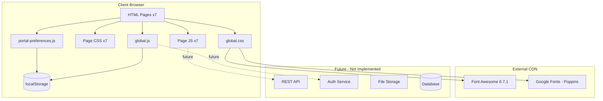
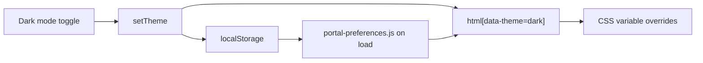
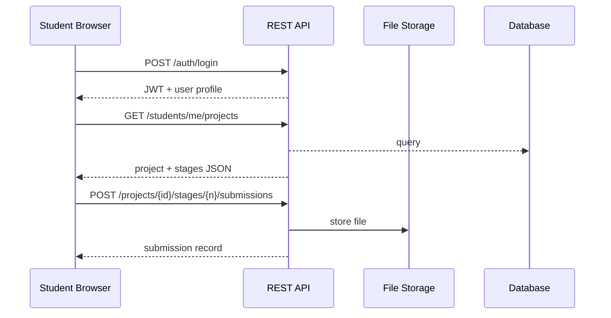

# Architecture

## Rapid Prototyping Lab — Student Portal

This document describes the technical architecture of the student portal as implemented in the `student portal from scratch/` directory.

---

## 1. System Context



The portal is a **static multi-page application (MPA)**. There is no application server, bundler, or framework in the current stack. Each route is a standalone HTML file that shares common assets.

---

## 2. Technology Stack

| Layer | Technology |
|-------|------------|
| Markup | HTML5 |
| Styling | CSS3 (custom properties, Flexbox, Grid) |
| Scripting | Vanilla JavaScript (ES5/ES6) |
| Icons | Font Awesome 6.7.1 (CDN) |
| Typography | Poppins via Google Fonts |
| State persistence | `localStorage` (theme, sidebar collapse) |
| Build tooling | None (optional Python scripts in parent repo for migration) |

---

## 3. Directory Structure

```
student portal from scratch/
├── dashboard.html
├── myprofile.html
├── ongoingprojects.html
├── completedprojects.html
├── knowledgebase.html
├── supportcenter.html
├── settings.html
├── PRD.md
├── ARCHITECTURE.md
├── CURRENT_STATE.md
└── assets/
    ├── css/
    │   ├── global.css              # Shared layout, components, themes
    │   ├── dashboard.css
    │   ├── myprofile.css
    │   ├── ongoingprojects.css
    │   ├── completedprojects.css
    │   ├── knowledgebase.css
    │   ├── supportcenter.css
    │   └── settings.css
    ├── js/
    │   ├── portal-preferences.js   # Early-load theme & sidebar prefs
    │   ├── global.js               # Sidebar, nav, toasts, toggles
    │   ├── dashboard.js
    │   ├── myprofile.js
    │   ├── ongoingprojects.js      # Richest page logic
    │   ├── completedprojects.js
    │   ├── knowledgebase.js
    │   ├── supportcenter.js
    │   └── settings.js
    └── images/
        └── OIP.webp
```

**Parent repository** (`student-portal/`) contains legacy page copies, `login.html`, `login.js`, and Python migration scripts (`build_portal.py`, `fix_*.py`). The canonical student portal is `student portal from scratch/`.

---

## 4. Page Architecture Pattern

Every portal page follows the same shell:

```html
<head>
  <script src="assets/js/portal-preferences.js"></script>  <!-- sync, before CSS -->
  <link rel="stylesheet" href="... font-awesome ...">
  <link rel="stylesheet" href="assets/css/global.css">
  <link rel="stylesheet" href="assets/css/{page}.css">
</head>
<body>
  <div class="dashboard-container">
    <aside class="sidebar">...</aside>       <!-- duplicated per page -->
    <main class="main-content">
      <header class="top-navbar">...</header> <!-- duplicated per page -->
      <section class="dashboard-content">    <!-- page-specific -->
      <footer class="dashboard-footer">...</footer>
    </main>
  </div>
  <script src="assets/js/global.js"></script>
  <script src="assets/js/{page}.js"></script>
</body>
```

### Trade-offs

| Approach | Benefit | Cost |
|----------|---------|------|
| Duplicated sidebar/header per HTML file | Simple static hosting, no build step | Layout changes require editing 7 files |
| Page-specific CSS/JS | Clear separation, smaller per-page mental model | Some duplication of tab/modal patterns |
| No framework | Zero dependencies, easy to open locally | Manual state management, no component reuse |

A future refactor could extract sidebar/header into JS templates or migrate to a static site generator / SPA.

---

## 5. CSS Architecture

### 5.1 Design Tokens (`global.css` `:root`)

```css
--primary, --primary-dark, --primary-light
--background, --card
--text-dark, --text-light
--success, --warning, --danger
--border, --radius, --shadow
--surface-hover, --surface-muted
```

Dark mode overrides via `[data-theme="dark"]` on `<html>`.

### 5.2 Layering

```
global.css
  ├── Reset & typography
  ├── CSS variables (light + dark)
  ├── Layout (dashboard-container, sidebar, main-content)
  ├── Top navbar
  ├── Shared components (panel, stat-card, btn, table, form, modal, toast)
  ├── Sidebar collapsed + flyout submenu
  ├── Responsive breakpoints (1200, 992, 768, 480px)
  └── Dark mode page-specific overrides

{page}.css
  └── Page-only layout and components
```

### 5.3 Responsive Breakpoints

| Breakpoint | Behavior |
|------------|----------|
| ≤ 1200px | Stats/overview grids reduce columns |
| ≤ 992px | Sidebar auto icon-only; hamburger visible |
| ≤ 768px | Sidebar becomes off-canvas drawer with overlay |
| ≤ 480px | Reduced padding, single-column grids |

---

## 6. JavaScript Architecture

### 6.1 Load Order

```
1. portal-preferences.js  (head, blocking)
      → reads localStorage
      → sets data-theme on <html>
      → exposes window.PortalPreferences

2. global.js              (body end, DOMContentLoaded)
      → injects UI toggles
      → sidebar collapse / flyout submenu
      → nav highlighting
      → notifications dropdown
      → showToast(), validateForm()

3. {page}.js              (body end, DOMContentLoaded)
      → page-specific tabs, forms, data rendering
```

### 6.2 PortalPreferences API

```javascript
window.PortalPreferences = {
  getTheme()           → 'light' | 'dark'
  setTheme(theme)      → writes localStorage + applies
  applyTheme(theme)
  getSidebarCollapsed() → boolean
  setSidebarCollapsed(collapsed)
  applySidebarCollapsedPref()
  clearSidebarCollapsedPref()
}
```

**Storage keys:**

| Key | Values |
|-----|--------|
| `portal-theme` | `light` \| `dark` |
| `portal-sidebar-collapsed` | `true` \| `false` |

Cross-tab sync via `storage` event; cross-page sync via head script + `pageshow` listener.

### 6.3 Global.js Responsibilities

| Module | Responsibility |
|--------|----------------|
| Sidebar collapse | Toggle `.collapsed` on `.sidebar`; persist preference |
| Submenu flyout | When collapsed, `.has-submenu.flyout-open` positions fixed submenu |
| Dark mode toggle | Injected into `.nav-right` |
| Collapse toggle | Injected into `.sidebar-collapse-wrap` above footer |
| Nav highlighting | Matches `window.location.pathname` to sidebar links |
| Notifications | Toggle `.notification-dropdown.show` |
| Toasts | `showToast(message, 'success'\|'warning'\|'error')` |
| Form validation | `validateForm(form)` for required/email fields |

### 6.4 Ongoing Projects Data Model (Client-Side)

The richest page logic lives in `ongoingprojects.js`:

```javascript
const stages = [
  { id, name, status, deadline, deadlineLabel, description,
    uploadDescription, feedback }
  // status: 'completed' | 'current' | 'upcoming'
];

const submissions = [
  { stageId, stageLabel, document, icon, iconColor,
    submitted, status, statusClass, feedback }
];

const LAB_SLOTS = [ { id, label } ];
const EQUIPMENT_BOOKINGS = { '3D Printer': ['09-10', ...] };
```

**Runtime behaviors:**

- Stepper click → `selectStage(id)` → updates detail panel, upload panel, submission history filter
- File submit on current stage → pushes to `submissions[]` with status "Approval Pending"
- Equipment booking → mock slot grid from equipment + date; weekend blocked

---

## 7. Component Inventory (Shared)

| Component | CSS class | Used on |
|-----------|-----------|---------|
| Panel | `.panel` | All content pages |
| Stat card | `.stat-card` | Dashboard, Completed, KB |
| Status pill | `.status-pill.{success,warning,danger}` | Tables, stage detail |
| Tab bar | `.{project,support,kb,settings}-tabs` | Multi-tab pages |
| Modal | `.modal-overlay` + `.modal` | Support ticket form |
| Toast | `.toast-container` → `.toast` | Global (dynamic) |
| Table | `.table-wrapper` + `table` | History, tickets, reports |
| Upload area | `.upload-area` | Ongoing projects |
| Slot picker | `.slot-picker` + `.slot-btn` | Equipment booking |

---

## 8. Navigation Model

```
Sidebar
├── Dashboard          → dashboard.html
├── My Profile         → myprofile.html
├── My Projects ▾
│   ├── Ongoing        → ongoingprojects.html
│   └── Completed      → completedprojects.html
├── Support Center     → supportcenter.html
├── Knowledge Base     → knowledgebase.html
├── Settings           → settings.html
└── Logout             → # (not implemented)

Collapsed mode:
  My Projects icon → flyout submenu (fixed position)
```

Active route detection: filename match (`ongoingprojects.html` etc.). Submenu parent auto-opens when child route is active (expanded mode only).

---

## 9. Theming



Light and dark palettes preserve status colors (`--success`, `--warning`, `--danger`) for usability. Dark mode adds targeted overrides for page-specific white backgrounds (tabs, cards, forms, upload area).

---

## 10. Integration Boundaries (Future)



Recommended API resource groups:

| Resource | Endpoints |
|----------|-----------|
| Auth | `POST /auth/login`, `POST /auth/logout`, `POST /auth/password` |
| Profile | `GET /students/me` |
| Projects | `GET /projects`, `GET /projects/{id}`, `GET /projects/{id}/stages` |
| Submissions | `POST /projects/{id}/stages/{id}/submissions`, `GET .../history` |
| Resources | `POST /bookings/components`, `POST /bookings/equipment` |
| Support | `GET /tickets`, `POST /tickets` |
| Knowledge | `GET /resources`, `POST /report-requests` |

---

## 11. Security Considerations (Production)

| Risk | Mitigation |
|------|------------|
| No auth on static pages | Gate behind login; use server sessions or JWT |
| Client-side mock data | Replace with authenticated API responses |
| File upload | Server-side type/size validation, virus scan, signed URLs |
| XSS | Sanitize rendered mentor feedback; CSP headers |
| localStorage theme | Low risk; do not store tokens in localStorage if avoidable |

---

## 12. Deployment Model

**Current:** Open `*.html` directly or serve via any static file server (nginx, `python -m http.server`, Live Server).

**Recommended production:**

```
CDN / Static host  →  student portal from scratch/
API server         →  separate origin with CORS
Login              →  integrate login.html or SSO redirect
```

No `package.json`, bundler, or CI pipeline exists in the active portal directory today.

---

## 13. Related Artifacts

| Artifact | Location |
|----------|----------|
| Product requirements | `PRD.md` |
| Implementation status | `CURRENT_STATE.md` |
| Login prototype | `../login.html`, `../login.js` |
| Build/migration scripts | `../build_portal.py`, `../fix_*.py` |
